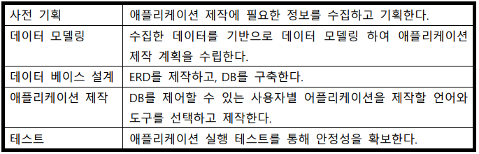
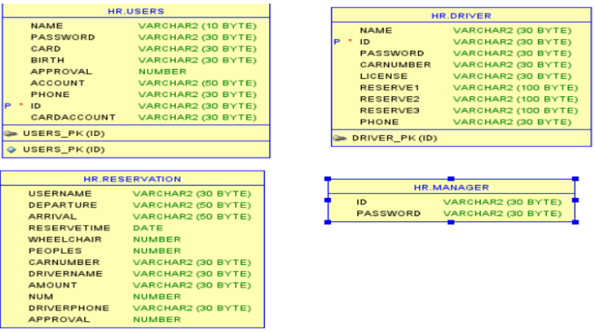
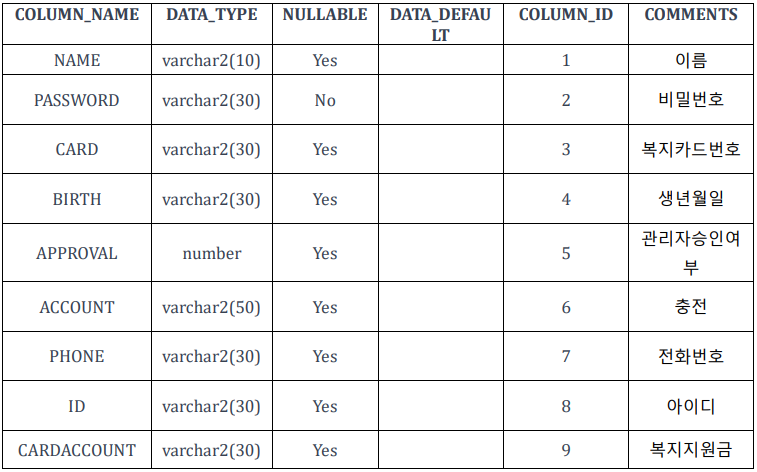
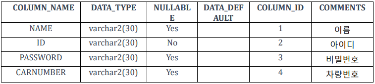
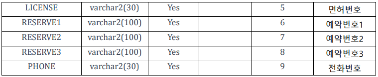
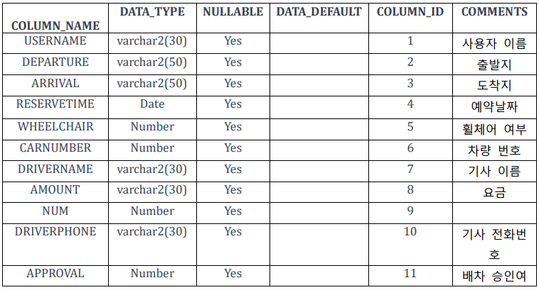
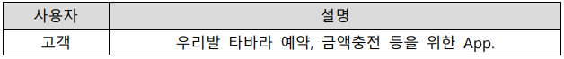
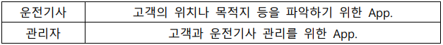
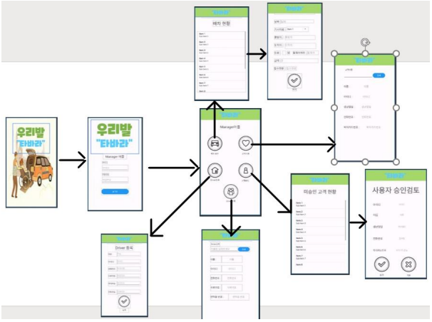

# 그룹웨어 어플리케이션 제작 실습 포트폴리오

###### 팀원 : 송민종, 정경훈, 김근우

### 1.서론
#### A.어플리케이션 제작동기
자바 프로그래밍 수업을 통해 익힌 코딩 기술을 활용하여 일반 택시를 이용하기 어려운 장애인분들을 위한 전용 이동 수단 서비스를 예약하고, 관리할 수 있는 어플리케이션을 제작하려고 한다.

#### B.프로젝트 기획

### 2.본론
#### A.사전기획
사전기획 목적 : 프로젝트 시스템을 구축하기 위해 어플리케이션 구성을 분석하고 필요한 기능을 구상하기 위함.
사전기획 후기 : 기존의 다른 택시 어플리케이션을 분석하여 어플리케이션의 전체적인 툴과 데이터베이스 구축에 필요한 정보를 알 수 있었음.

#### B.데이터모델링
##### 1)ERD 다이어그램

##### 2)Table Detail
-users : 사용자 테이블

-driver : 운전기사 테이블

-reservation : 예약관리 테이블

##### 3)DataBase 구축 명세
-DataBase : Oracle DataBase version 11g

-server : 학습용 노트북

#### C.Application 설계
-사용자정의

-Activity스토리보드

#### D.개발환경
-사용언어 : Java(JDK17), SQL

-Database : Oracle Database 11g

-개발도구 : Android Studio 2022.3.1.Patch2, DBeaver

#### E.App테스트 및 검증
-Unit Testing :  액티비티 클래스 코드 작성시, 이전 액티비티에서 intent로 넘겨 받은 값을 임의의 textView에 출력하여, 정상적으로 값을 받아오는지 확인함. - Embedded SQL을 작성전, Oracle SQL Developer에서 SQL문을 실행하여 결과값을 확인함

-Integration Testing :  테스트용 사용자 데이터를 생성하여 전체적인 기능을 시연함

-Peer Testing :  스터디그룹 맴버에게 코드 검토, 버그 식별 등을 의뢰하고 피드백을 받음

### 3.결론
#### A.프로젝트 요약
본 프로젝트는 Java 언어를 접하고 배우면서, 실전 응용프로그램을 개발하고자 하였으며, 그 최초 아이디어는 장애인을 위한 어플리케이션 제작에 있었다. 그 중 먼 곳을 이동할 때 필요한 장애인전용 택시에 대한 아이디어를 떠올렸다. 그리하여 Java 언어를 기반으로 안드로이드 스튜디오를 활용하여 가상의 이동 수단 서비스 “우리발 타바라”를 만들고 그에 필요한 애플리케이션을 제작하였다.

#### B.프로젝트 후기
본 프로젝트를 통하여, Java 언어의 문법과 객체지향 프로그래밍의 이론을 직접적인 프로젝트 구현을 통해 익힐 수 있었다. 또한 오라클 데이터베이스를 직접 설계하고 구현하면서, 어떤 테이블이 필요할 지에 대해 직접 앱을 제작하고 경험하면서 알게 되어 SQL 문법과 관계형 데이터베이스에 대한 이해 능력이 상승했다. 그리고 안드로이드 스튜디오를 사용하면서 안드로이드용 앱 UI 디자인 및 앱 개발에 대한 지식을 습득할 수 있었다.본 프로젝트는 기획 의도에 알맞게 제작되었으나, 고객센터 제작 등 기능적 부분에서약간 아쉬운 부분이 있었다. 특히, 네이버, 카카오 API로 로그인 구현을 하지 못한 부분과 네이버지도 API로 출발지, 도착지를 제대로 적용하지 못했던 부분이 아쉬웠다. 이번의 경험을 통해 우리의 성과가 어느 정도였는지를 파악하였으며, 이번 경험의 피드백을 통해 부족한 부분을 열심히 공부할 예정이다
